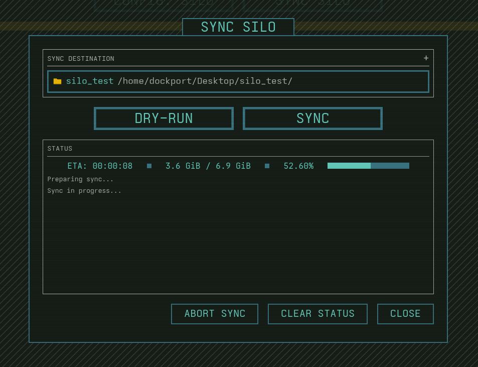

# Silo

Silo is an rsync GUI application. It lets you define a body of data — a "silo" — by selecting & excluding folders from source, then mirror that silo to a destination with rsync. The interface will also show you an analytical breakdown of your populated silo. 
Beyond just backing up, you'll have a clear, comprehensive overview of everything inside your siloed data.
The UI interface carries a theme inspired by the TV show *Silo*.

> **Status: Early development.**
> This project is in the early stages of development.

## Planned features

- Populate a silo by selecting folders.
- Persist silo settings (paths, excludes, destination, timestamps) to a local SQLite store under `~/.local`
- Mirror the silo to any local destination using rsync, with the destination kept as a 100% mirror of the source
- Silo monitoring: overall size, item/file counts, last-sync timestamp and more

## Tech stack

| Component | Technology |
|---|---|
| Language | Rust |
| GUI | Iced |
| Config | SQLite |
| Sync engine | rsync |
| Distribution  | AppImage |

## UI preview

## More about rsync:

Rsync is a fast and extraordinarily versatile file copying tool for both remote and local files.

Rsync uses a delta-transfer algorithm which provides a very fast method for bringing remote files into sync. It does this by sending just the differences in the files across the link, without requiring that both sets of files are present at one of the ends of the link beforehand. At first glance this may seem impossible because the calculation of diffs between two files normally requires local access to both files.

https://github.com/RsyncProject/rsync

## Distribution

Silo releases are available as an AppImage which means "one app = one file", which you can download and run on your Linux system while you don't need a package manager and nothing gets changed in your system.

AppImages are single-file applications that run on most Linux distributions. Download an application, make it executable, and run! No need to install. No system libraries or system preferences are altered. 

Unlike other applications, AppImages do not need to be installed before they can be used. However, they need to be marked as executable before they can be run. This is a Linux security feature.

Visit the releases page to find the latest AppImage release here: https://github.com/DOCKPORT/Silo/releases

More info on AppImage: https://appimage.org/